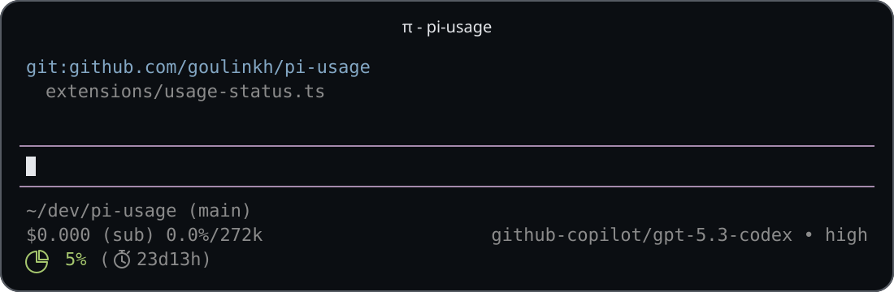

# pi-usage



Footer status extension for [pi](https://github.com/earendil-works/pi-mono/tree/main/packages/coding-agent) that shows available usage windows. Currently supports Codex.

## Install

This package is not published to npm. Install directly from GitHub:

```bash
pi install git:github.com/goulinkh/pi-usage
```

## Authentication

Sign in to `openai-codex` in pi (`/login openai-codex`). The footer shows usage for this account, not the `openai` account. If you use multiple accounts, sign in to both providers with the same account.

## Commands

| Command | Effect |
| --- | --- |
| `/usage-mode` | Toggle display mode (`left` ↔ `used`). |
| `/usage-mode left` | Show percent left. |
| `/usage-mode used` | Show percent used. |

## Settings

The extension persists the display preference in pi's `settings.json` under:

```json
{
  "pi-usage": {
    "usageMode": "left"
  }
}
```

- Settings file path: `$PI_CODING_AGENT_DIR/settings.json`
- Fallback when the environment variable is unset: `~/.pi/agent/settings.json`
- The default is `usageMode: "left"`.

Example outputs:

- A response with only a primary window → `Codex 7d:97% left (↺6d22h)`
- A response with a secondary window → `Codex 5h:81% left (↺2h10m) 7d:64% left (↺6d22h)`
